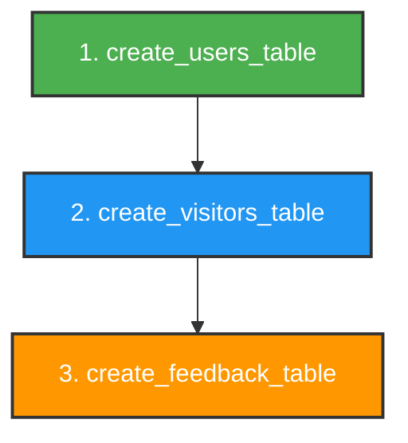
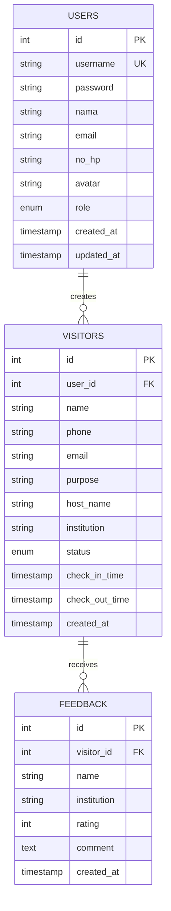

# BUTAKA

# 🌐 API Endpoints Documentation - Butaka

> **Buku Tamu Kantor (Guest Book System)**  
> REST API untuk sistem manajemen kunjungan tamu berbasis Laravel + Vue.js

---

## 📋 **Daftar Isi**

### Database & Setup
- [Analisis Database](#-analisis-database-existing)
- [Migration Laravel](#-migration-yang-diperlukan)
- [Urutan Migration](#-urutan-pembuatan-migration)
- [Detail Migration](#-detail-migration)

### Role & Access
- [Alur Sistem & Role](#-alur-sistem--role-based-access)
- [Same Page Different Content](#-same-page-different-content)

### API Endpoints
- [Quick Reference](#-quick-reference---endpoint-summary)
- [Authentication](#-authentication-endpoints) (7 endpoints)
- [User Management](#-user-management-endpoints) (5 endpoints)
- [Visitor Management](#-visitor-management-endpoints) (7 endpoints)
- [Feedback Management](#-feedback-management-endpoints) (4 endpoints)
- [Dashboard & Statistics](#-dashboard--statistics-endpoints) (4 endpoints)

### Reference
- [Complete Endpoint List](#-complete-endpoint-list)
- [Permission Matrix](#permission-matrix-by-role)
- [Best Practices](#-best-practices)
- [Response Format](#-response-format-standard)

---

## 🎯 **Tentang Sistem**

**Butaka** adalah sistem buku tamu digital yang memungkinkan:
- 🟡 Tamu **check-in mandiri** tanpa bantuan staff
- 🟢 Resepsionis **checkout** tamu yang sudah pulang
- 🔴 Admin **mengelola** seluruh sistem

**Tech Stack:**
- **Backend**: Laravel 10+ (REST API)
- **Frontend**: Vue.js 3
- **Auth**: Laravel Sanctum (Token-based)
- **Database**: MySQL

---

## 🗄️ **Database & Migration Guide**

> 📚 **Panduan Lengkap**: Struktur database dan Laravel migration untuk Butaka system

Bagian ini menjelaskan:
- 📊 Struktur tabel database (3 tabel utama)
- 🔧 Migration Laravel yang diperlukan (6 total)
- 📂 Urutan pembuatan migration (penting untuk foreign key!)
- 📝 Code example migration Laravel
- 🔗 Entity Relationship Diagram (ERD)

---

## 📊 **Analisis Database Existing**

Berdasarkan file `database/db.sql`, proyek saat ini memiliki **3 tabel utama**:

### 1. **Tabel `users`**
Menyimpan data pengguna sistem (admin dan receptionist)

| Kolom | Tipe Data | Keterangan |
|-------|-----------|------------|
| id | INT AUTO_INCREMENT | Primary Key |
| username | VARCHAR(255) | Unique, Not Null |
| password_hash | VARCHAR(255) | Not Null |
| nama | VARCHAR(255) | Nullable |
| email | VARCHAR(255) | Nullable |
| no_hp | VARCHAR(20) | Nullable |
| avatar | VARCHAR(255) | Nullable (path/URL foto profil) |
| role | ENUM('admin', 'receptionist') | Not Null |
| created_at | TIMESTAMP | Default CURRENT_TIMESTAMP |
| updated_at | TIMESTAMP | Auto update |

### 2. **Tabel `visitors`**
Menyimpan data pengunjung

| Kolom | Tipe Data | Keterangan |
|-------|-----------|------------|
| id | INT AUTO_INCREMENT | Primary Key |
| user_id | INT | Foreign Key (users.id), Nullable |
| name | VARCHAR(255) | Not Null |
| phone | VARCHAR(20) | Nullable |
| email | VARCHAR(255) | Nullable |
| purpose | VARCHAR(255) | Nullable |
| host_name | VARCHAR(255) | Nullable |
| institution | VARCHAR(255) | Nullable |
| status | ENUM | 'menunggu', 'berkunjung', 'selesai' |
| check_in_time | TIMESTAMP | Default CURRENT_TIMESTAMP |
| check_out_time | TIMESTAMP | Nullable |
| created_at | TIMESTAMP | Default CURRENT_TIMESTAMP |

**Relasi**: `user_id` → `users(id)` (ON DELETE SET NULL)

### 3. **Tabel `feedback`**
Menyimpan feedback dari pengunjung

| Kolom | Tipe Data | Keterangan |
|-------|-----------|------------|
| id | INT AUTO_INCREMENT | Primary Key |
| visitor_id | INT | Foreign Key (visitors.id), Nullable |
| name | VARCHAR(255) | Nullable |
| institution | VARCHAR(255) | Nullable |
| rating | INT | Check: 1-5 |
| comment | TEXT | Nullable |
| created_at | TIMESTAMP | Default CURRENT_TIMESTAMP |

**Relasi**: `visitor_id` → `visitors(id)` (ON DELETE CASCADE)

---

## 🔧 **Migration yang Diperlukan**

### **Migration Wajib (3 file)**

| No | Nama Migration | Tabel | Prioritas |
|----|---------------|-------|-----------|
| 1 | `create_users_table` | users | 🔴 Tinggi |
| 2 | `create_visitors_table` | visitors | 🔴 Tinggi |
| 3 | `create_feedback_table` | feedback | 🔴 Tinggi |

### **Migration Recommended (3 file)**

| No | Nama Migration | Keperluan | Prioritas |
|----|---------------|-----------|-----------|  
| 4 | `create_personal_access_tokens_table` | Laravel Sanctum (API Auth) | 🟡 Sedang |
| 5 | `create_password_reset_tokens_table` | Reset Password | 🟢 Rendah |
| 6 | `create_failed_jobs_table` | Queue Management | 🟢 Rendah |
---

## 📂 **Urutan Pembuatan Migration**

> ⚠️ **Penting**: Urutan ini sangat penting karena ada relasi foreign key antar tabel!



**Alasan urutan:**
1. ✅ `users` dibuat pertama → direferensi oleh `visitors`
2. ✅ `visitors` dibuat kedua → direferensi oleh `feedback`
3. ✅ `feedback` dibuat terakhir → tidak direferensi oleh tabel lain

---

## 📝 **Detail Migration**

### **1. Migration: Create Users Table**

**Command:**
```bash
php artisan make:migration create_users_table
```

**File:** `database/migrations/xxxx_xx_xx_create_users_table.php`

**Struktur:**
```php
Schema::create('users', function (Blueprint $table) {
    $table->id();
    $table->string('username')->unique();
    $table->string('password'); // Laravel convention: 'password' bukan 'password_hash'
    $table->string('nama')->nullable();
    $table->string('email')->nullable();
    $table->string('no_hp', 20)->nullable();
    $table->string('avatar')->nullable(); // Path atau URL untuk foto profil/logo
    $table->enum('role', ['admin', 'receptionist']);
    $table->timestamps(); // created_at & updated_at
});
```

**Catatan:**
- Laravel menggunakan kolom `password` (bukan `password_hash`)
- `timestamps()` otomatis membuat `created_at` dan `updated_at`

---

### **2. Migration: Create Visitors Table**

**Command:**
```bash
php artisan make:migration create_visitors_table
```

**File:** `database/migrations/xxxx_xx_xx_create_visitors_table.php`

**Struktur:**
```php
Schema::create('visitors', function (Blueprint $table) {
    $table->id();
    $table->foreignId('user_id')->nullable()->constrained('users')->onDelete('set null');
    $table->string('name');
    $table->string('phone', 20)->nullable();
    $table->string('email')->nullable();
    $table->string('purpose')->nullable();
    $table->string('host_name')->nullable();
    $table->string('institution')->nullable();
    $table->enum('status', ['menunggu', 'berkunjung', 'selesai'])->default('menunggu');
    $table->timestamp('check_in_time')->useCurrent();
    $table->timestamp('check_out_time')->nullable();
    $table->timestamp('created_at')->useCurrent();
});
```

**Catatan:**
- `foreignId()` + `constrained()` untuk foreign key relationship
- `onDelete('set null')` sesuai dengan database SQL asli

---

### **3. Migration: Create Feedback Table**

**Command:**
```bash
php artisan make:migration create_feedback_table
```

**File:** `database/migrations/xxxx_xx_xx_create_feedback_table.php`

**Struktur:**
```php
Schema::create('feedback', function (Blueprint $table) {
    $table->id();
    $table->foreignId('visitor_id')->nullable()->constrained('visitors')->onDelete('cascade');
    $table->string('name')->nullable();
    $table->string('institution')->nullable();
    $table->unsignedTinyInteger('rating'); // 1-5
    $table->text('comment')->nullable();
    $table->timestamp('created_at')->useCurrent();
});
```

**Catatan:**
- `onDelete('cascade')` → jika visitor dihapus, feedback juga terhapus
- `unsignedTinyInteger` cocok untuk rating 1-5

---

## 🔗 **Entity Relationship Diagram (ERD)**



**Relasi:**
- 👤 **Users** → **Visitors**: One-to-Many (satu user bisa handle banyak visitor)
- 🚶 **Visitors** → **Feedback**: One-to-Many (satu visitor bisa beri banyak feedback)

**Foreign Keys:**
- `visitors.user_id` → `users.id` (ON DELETE SET NULL)
- `feedback.visitor_id` → `visitors.id` (ON DELETE CASCADE)

---

## 👥 **Alur Sistem & Role-Based Access**

### **Role 1: 🟡 Guest/Tamu (Public - No Auth)**

**Akses:**
```
URL: / (halaman utama)
Auth: ❌ Tidak perlu login
```

**Kemampuan:**
- ✅ Input data kunjungan sendiri
- ✅ Submit feedback (opsional)
- ❌ Tidak bisa lihat data tamu lain

**Endpoint:**
- `POST /api/visitors` - Check-in
- `POST /api/feedback` - Submit feedback

---

### **Role 2: 🟢 Resepsionis (Authenticated)**

**Akses:**
```
URL: / (halaman yang sama, konten berbeda)
Auth: ✅ Required (Bearer token)
```

**Kemampuan:**
- ✅ Lihat **tabel daftar tamu**
- ✅ **Checkout** tamu yang pulang
- ❌ **TIDAK bisa**: check-in, edit, delete tamu
- ❌ **TIDAK bisa**: akses dashboard/statistik

**Endpoint:**
- `GET /api/visitors` - List tamu
- `POST /api/visitors/{id}/checkout` - Checkout tamu

---

### **Role 3: 🔴 Admin (Full Access)**

**Akses:**
```
URL: /admin/dashboard
Auth: ✅ Required (Bearer token)
```

**Kemampuan:**
- ✅ **Full CRUD** semua data
- ✅ Kelola user (resepsionis)
- ✅ Dashboard & statistik
- ✅ Export laporan

**Endpoint:** Semua endpoint tersedia

---

## 🔀 **Same Page, Different Content**

> **💡 Konsep Penting**: Halaman utama (`/`) menampilkan konten berbeda berdasarkan role

**Conditional Rendering:**

| Role | URL | Tampilan | Auth |
|------|-----|----------|------|
| 🟡 **Guest** | `/` | Form Check-in + Feedback | ❌ No |
| 🟢 **Receptionist** | `/` | Tabel Visitor List + Tombol Checkout | ✅ Yes |
| 🔴 **Admin** | `/admin` | Dashboard Lengkap | ✅ Yes |

**Vue.js Implementation:**
```vue
<template>
  <!-- Single Page, Multiple Views -->
  <div class="main-page">
    <!-- View 1: Guest (Public) -->
    <GuestCheckinForm v-if="!isAuthenticated" />
    
    <!-- View 2: Receptionist (Authenticated) -->
    <VisitorCheckoutTable 
      v-else-if="user.role === 'receptionist'" 
      @checkout="handleCheckout" 
    />
    
    <!-- View 3: Admin (Redirect) -->
    <template v-else-if="user.role === 'admin'">
      <Redirect to="/admin/dashboard" />
    </template>
  </div>
</template>
```

**API Mapping:**
- 🟡 Guest → `POST /api/visitors`
- 🟢 Receptionist → `GET /api/visitors`, `POST /api/visitors/{id}/checkout`
- 🔴 Admin → All endpoints

---

## 🔐 **Authentication Endpoints**

### **1. POST /api/auth/register**
**Tujuan**: Registrasi user baru (admin/receptionist)

**Method**: `POST`  
**Auth Required**: ❌ No (atau ✅ Yes untuk admin yang membuat receptionist)  
**Role**: Admin (untuk membuat user lain)

**Request Body**:
```json
{
  "username": "admin123",
  "password": "password123",
  "password_confirmation": "password123",
  "nama": "John Doe",
  "email": "admin@example.com",
  "no_hp": "081234567890",
  "role": "admin"
}
```

**Response (201 Created)**:
```json
{
  "success": true,
  "message": "User berhasil didaftarkan",
  "data": {
    "user": {
      "id": 1,
      "username": "admin123",
      "nama": "John Doe",
      "email": "admin@example.com",
      "role": "admin"
    },
    "token": "1|xyz..."
  }
}
```

**Fungsi**:
- Membuat akun user baru
- Hash password dengan bcrypt
- Generate API token (Sanctum)
- Return user data + token

---

### **2. POST /api/auth/login**
**Tujuan**: Login user (admin/receptionist)

**Method**: `POST`  
**Auth Required**: ❌ No

**Request Body**:
```json
{
  "username": "admin123",
  "password": "password123"
}
```

**Response (200 OK)**:
```json
{
  "success": true,
  "message": "Login berhasil",
  "data": {
    "user": {
      "id": 1,
      "username": "admin123",
      "nama": "John Doe",
      "email": "admin@example.com",
      "role": "admin"
    },
    "token": "2|abc..."
  }
}
```

**Fungsi**:
- Verifikasi kredensial user
- Generate access token untuk API
- Return user info + token untuk disimpan di frontend

---

### **3. POST /api/auth/logout**
**Tujuan**: Logout user dan hapus token

**Method**: `POST`  
**Auth Required**: ✅ Yes  
**Headers**: `Authorization: Bearer {token}`

**Response (200 OK)**:
```json
{
  "success": true,
  "message": "Logout berhasil"
}
```

**Fungsi**:
- Revoke current access token
- Clear session

---

### **4. GET /api/auth/me**
**Tujuan**: Get data user yang sedang login

**Method**: `GET`  
**Auth Required**: ✅ Yes  
**Headers**: `Authorization: Bearer {token}`

**Response (200 OK)**:
```json
{
  "success": true,
  "data": {
    "id": 1,
    "username": "admin123",
    "nama": "John Doe",
    "email": "admin@example.com",
    "no_hp": "081234567890",
    "avatar": "/storage/avatars/user1.jpg",
    "role": "admin",
    "created_at": "2026-01-08T09:00:00.000000Z"
  }
}
```

**Fungsi**:
- Ambil data user dari token
- Digunakan untuk profile page
- Check authentication status

---

### **5. PUT /api/auth/profile**
**Tujuan**: Update profile user

**Method**: `PUT`  
**Auth Required**: ✅ Yes

**Request Body**:
```json
{
  "nama": "John Doe Updated",
  "email": "newemail@example.com",
  "no_hp": "081234567890"
}
```

**Response (200 OK)**:
```json
{
  "success": true,
  "message": "Profile berhasil diupdate",
  "data": {
    "id": 1,
    "nama": "John Doe Updated",
    "email": "newemail@example.com"
  }
}
```

**Fungsi**:
- Update data profile user
- Tidak bisa update username/password (ada endpoint terpisah)

---

### **6. POST /api/auth/change-password**
**Tujuan**: Ganti password user

**Method**: `POST`  
**Auth Required**: ✅ Yes

**Request Body**:
```json
{
  "current_password": "oldpassword",
  "new_password": "newpassword",
  "new_password_confirmation": "newpassword"
}
```

**Response (200 OK)**:
```json
{
  "success": true,
  "message": "Password berhasil diubah"
}
```

**Fungsi**:
- Verifikasi password lama
- Hash password baru
- Update ke database

---

### **7. POST /api/auth/upload-avatar**
**Tujuan**: Upload foto profil user

**Method**: `POST`  
**Auth Required**: ✅ Yes  
**Content-Type**: `multipart/form-data`

**Request Body**:
```
avatar: [file]
```

**Response (200 OK)**:
```json
{
  "success": true,
  "message": "Avatar berhasil diupload",
  "data": {
    "avatar_url": "/storage/avatars/user1.jpg"
  }
}
```

**Fungsi**:
- Upload dan simpan avatar ke storage
- Update avatar path di database
- Return URL avatar

---

## 👥 **User Management Endpoints**

### **8. GET /api/users**
**Tujuan**: List semua users (admin only)

**Method**: `GET`  
**Auth Required**: ✅ Yes  
**Role**: Admin only

**Query Parameters**:
- `page` (optional): Pagination page number
- `per_page` (optional): Items per page (default: 15)
- `search` (optional): Search by name/username
- `role` (optional): Filter by role (admin/receptionist)

**Response (200 OK)**:
```json
{
  "success": true,
  "data": {
    "users": [
      {
        "id": 1,
        "username": "admin",
        "nama": "Admin User",
        "email": "admin@example.com",
        "role": "admin",
        "created_at": "2026-01-01T00:00:00.000000Z"
      }
    ],
    "pagination": {
      "total": 25,
      "per_page": 15,
      "current_page": 1,
      "last_page": 2
    }
  }
}
```

**Fungsi**:
- Tampilkan semua users
- Support pagination
- Support search & filter

---

### **9. GET /api/users/{id}**
**Tujuan**: Detail user tertentu

**Method**: `GET`  
**Auth Required**: ✅ Yes  
**Role**: Admin only

**Response (200 OK)**:
```json
{
  "success": true,
  "data": {
    "id": 1,
    "username": "admin",
    "nama": "Admin User",
    "email": "admin@example.com",
    "no_hp": "081234567890",
    "role": "admin",
    "created_at": "2026-01-01T00:00:00.000000Z"
  }
}
```

**Fungsi**:
- Tampilkan detail satu user
- Untuk edit form

---

### **10. POST /api/users**
**Tujuan**: Buat user baru (admin only)

**Method**: `POST`  
**Auth Required**: ✅ Yes  
**Role**: Admin only

**Request Body**: (sama seperti register)

**Fungsi**:
- Admin buat user baru (receptionist)
- Sama seperti register tapi khusus admin

---

### **11. PUT /api/users/{id}**
**Tujuan**: Update user tertentu

**Method**: `PUT`  
**Auth Required**: ✅ Yes  
**Role**: Admin only

**Request Body**:
```json
{
  "nama": "Updated Name",
  "email": "updated@example.com",
  "no_hp": "081234567890",
  "role": "receptionist"
}
```

**Fungsi**:
- Update data user lain
- Tidak bisa update password (ada endpoint terpisah)

---

### **12. DELETE /api/users/{id}**
**Tujuan**: Hapus user

**Method**: `DELETE`  
**Auth Required**: ✅ Yes  
**Role**: Admin only

**Response (200 OK)**:
```json
{
  "success": true,
  "message": "User berhasil dihapus"
}
```

**Fungsi**:
- Soft delete user
- Tidak bisa hapus diri sendiri

---

## 🚶 **Visitor Management Endpoints**

### **13. GET /api/visitors**
**Tujuan**: List semua pengunjung

**Method**: `GET`  
**Auth Required**: ✅ Yes

**Query Parameters**:
- `page`, `per_page`: Pagination
- `search`: Search by name/institution
- `status`: Filter by status (menunggu/berkunjung/selesai)
- `date_from`, `date_to`: Filter by date range
- `sort_by`: Sort column (default: created_at)
- `sort_order`: asc/desc (default: desc)

**Response (200 OK)**:
```json
{
  "success": true,
  "data": {
    "visitors": [
      {
        "id": 1,
        "name": "Budi Santoso",
        "phone": "081234567890",
        "email": "budi@example.com",
        "purpose": "Meeting",
        "host_name": "Pak Ahmad",
        "institution": "PT Maju Jaya",
        "status": "berkunjung",
        "check_in_time": "2026-01-08T09:00:00.000000Z",
        "check_out_time": null,
        "created_by": {
          "id": 2,
          "nama": "Receptionist 1"
        }
      }
    ],
    "pagination": {
      "total": 100,
      "current_page": 1,
      "last_page": 7
    }
  }
}
```

**Fungsi**:
- List semua visitor dengan pagination
- Filter by status/date
- Search functionality
- Show created by user

---

### **14. GET /api/visitors/{id}**
**Tujuan**: Detail visitor tertentu

**Method**: `GET`  
**Auth Required**: ✅ Yes

**Response (200 OK)**:
```json
{
  "success": true,
  "data": {
    "id": 1,
    "name": "Budi Santoso",
    "phone": "081234567890",
    "email": "budi@example.com",
    "purpose": "Meeting Project",
    "host_name": "Pak Ahmad",
    "institution": "PT Maju Jaya",
    "status": "selesai",
    "check_in_time": "2026-01-08T09:00:00.000000Z",
    "check_out_time": "2026-01-08T11:00:00.000000Z",
    "created_by": {
      "id": 2,
      "nama": "Receptionist 1"
    },
    "feedback": {
      "rating": 5,
      "comment": "Pelayanan sangat baik"
    }
  }
}
```

**Fungsi**:
- Detail lengkap visitor
- Include feedback jika ada
- Untuk view detail page

---

### **15. POST /api/visitors** ⚠️ **PUBLIC ENDPOINT**
**Tujuan**: Check-in visitor baru (Guest self check-in)

**Method**: `POST`  
**Auth Required**: ❌ **No (Public - Tanpa Login)**  
**Role**: Guest (Tamu)

**Request Body**:
```json
{
  "name": "Budi Santoso",
  "phone": "081234567890",
  "email": "budi@example.com",
  "purpose": "Meeting",
  "host_name": "Pak Ahmad",
  "institution": "PT Maju Jaya"
}
```

**Response (201 Created)**:
```json
{
  "success": true,
  "message": "Terima kasih! Data kunjungan Anda telah tercatat.",
  "data": {
    "id": 1,
    "name": "Budi Santoso",
    "status": "menunggu",
    "check_in_time": "2026-01-08T09:00:00.000000Z"
  }
}
```

**Fungsi**:
- **Guest/Tamu input data sendiri** tanpa login
- Auto set status = "menunggu"
- Auto set check_in_time = now
- Validation: required fields (name, purpose)

> 💡 **Catatan Penting**: Endpoint ini adalah **PUBLIC** (tanpa autentikasi) karena tamu check-in sendiri di halaman public.

---

### **16. PUT /api/visitors/{id}**
**Tujuan**: Update data visitor

**Method**: `PUT`  
**Auth Required**: ✅ Yes  
**Role**: **Admin Only**

**Request Body**:
```json
{
  "name": "Budi Santoso Updated",
  "phone": "081234567890",
  "purpose": "Meeting Updated",
  "status": "berkunjung"
}
```

**Fungsi**:
- Edit data visitor (admin only)
- Bisa update status juga

---

### **17. PUT /api/visitors/{id}/status**
**Tujuan**: Update status visitor

**Method**: `PUT`  
**Auth Required**: ✅ Yes  
**Role**: **Admin Only**

**Request Body**:
```json
{
  "status": "berkunjung"
}
```

**Response (200 OK)**:
```json
{
  "success": true,
  "message": "Status visitor berhasil diupdate",
  "data": {
    "id": 1,
    "status": "berkunjung"
  }
}
```

**Fungsi**:
- Change status: menunggu → berkunjung (admin/host)
- Admin bisa update status manually

---

### **18. POST /api/visitors/{id}/checkout** 🟢 **RECEPTIONIST MAIN FUNCTION**
**Tujuan**: Check-out visitor (Receptionist checkout tamu yang pulang)

**Method**: `POST`  
**Auth Required**: ✅ Yes  
**Role**: **Admin, Receptionist**

**Response (200 OK)**:
```json
{
  "success": true,
  "message": "Tamu berhasil di-checkout",
  "data": {
    "id": 1,
    "name": "Budi Santoso",
    "status": "selesai",
    "check_out_time": "2026-01-08T11:00:00.000000Z"
  }
}
```

**Fungsi**:
- Set check_out_time = now
- Update status = "selesai"
- **Ini adalah fungsi UTAMA receptionist** - menandai tamu yang sudah pulang

> 💡 **Catatan**: Ini adalah **satu-satunya aksi** yang bisa dilakukan receptionist terhadap data visitor.

---

### **19. DELETE /api/visitors/{id}**
**Tujuan**: Hapus visitor

**Method**: `DELETE`  
**Auth Required**: ✅ Yes  
**Role**: Admin only

**Response (200 OK)**:
```json
{
  "success": true,
  "message": "Visitor berhasil dihapus"
}
```

**Fungsi**:
- Soft delete visitor record
- Cascade delete ke feedback (jika ada)

---

## 💬 **Feedback Management Endpoints**

### **20. GET /api/feedback**
**Tujuan**: List semua feedback

**Method**: `GET`  
**Auth Required**: ✅ Yes

**Query Parameters**:
- `page`, `per_page`: Pagination
- `rating`: Filter by rating (1-5)
- `search`: Search by name/institution
- `date_from`, `date_to`: Filter by date

**Response (200 OK)**:
```json
{
  "success": true,
  "data": {
    "feedback": [
      {
        "id": 1,
        "name": "Budi Santoso",
        "institution": "PT Maju Jaya",
        "rating": 5,
        "comment": "Pelayanan sangat memuaskan",
        "created_at": "2026-01-08T11:00:00.000000Z",
        "visitor": {
          "id": 1,
          "name": "Budi Santoso"
        }
      }
    ],
    "pagination": {
      "total": 50,
      "current_page": 1
    },
    "statistics": {
      "average_rating": 4.2,
      "total_feedback": 50
    }
  }
}
```

**Fungsi**:
- List semua feedback dengan pagination
- Include statistics (avg rating)
- Filter by rating/date

---

### **21. GET /api/feedback/{id}**
**Tujuan**: Detail feedback tertentu

**Method**: `GET`  
**Auth Required**: ✅ Yes

**Response (200 OK)**:
```json
{
  "success": true,
  "data": {
    "id": 1,
    "name": "Budi Santoso",
    "institution": "PT Maju Jaya",
    "rating": 5,
    "comment": "Pelayanan sangat memuaskan dan ramah",
    "created_at": "2026-01-08T11:00:00.000000Z",
    "visitor": {
      "id": 1,
      "name": "Budi Santoso",
      "check_in_time": "2026-01-08T09:00:00.000000Z"
    }
  }
}
```

**Fungsi**:
- Detail feedback lengkap
- Include visitor info

---

### **22. POST /api/feedback**
**Tujuan**: Submit feedback baru

**Method**: `POST`  
**Auth Required**: ❌ No (public endpoint untuk visitor)

**Request Body**:
```json
{
  "visitor_id": 1,
  "name": "Budi Santoso",
  "institution": "PT Maju Jaya",
  "rating": 5,
  "comment": "Pelayanan sangat memuaskan"
}
```

**Response (201 Created)**:
```json
{
  "success": true,
  "message": "Terima kasih atas feedback Anda!",
  "data": {
    "id": 1,
    "rating": 5
  }
}
```

**Fungsi**:
- Submit feedback dari visitor
- Public endpoint (tidak perlu auth)
- Validation rating 1-5

---

### **23. DELETE /api/feedback/{id}**
**Tujuan**: Hapus feedback

**Method**: `DELETE`  
**Auth Required**: ✅ Yes  
**Role**: Admin only

**Response (200 OK)**:
```json
{
  "success": true,
  "message": "Feedback berhasil dihapus"
}
```

**Fungsi**:
- Hapus feedback (admin only)
- Untuk spam/inappropriate content

---

## 📊 **Dashboard & Statistics Endpoints**

### **24. GET /api/dashboard/stats**
**Tujuan**: Get statistik untuk dashboard

**Method**: `GET`  
**Auth Required**: ✅ Yes

**Response (200 OK)**:
```json
{
  "success": true,
  "data": {
    "total_visitors": 150,
    "total_feedback": 45,
    "total_users": 5,
    "visitors_today": 12,
    "average_rating": 4.3,
    "status_breakdown": {
      "menunggu": 3,
      "berkunjung": 5,
      "selesai": 142
    },
    "visitors_this_week": 48,
    "visitors_this_month": 150
  }
}
```

**Fungsi**:
- Summary statistics untuk dashboard
- Real-time counts
- Support date filtering

---

### **25. GET /api/dashboard/recent-visitors**
**Tujuan**: Get visitor terbaru (untuk dashboard)

**Method**: `GET`  
**Auth Required**: ✅ Yes

**Query Parameters**:
- `limit` (default: 10)

**Response (200 OK)**:
```json
{
  "success": true,
  "data": [
    {
      "id": 1,
      "name": "Budi Santoso",
      "purpose": "Meeting",
      "status": "berkunjung",
      "check_in_time": "2026-01-08T09:00:00.000000Z"
    }
  ]
}
```

**Fungsi**:
- Show recent visitors di dashboard
- Quick overview

---

### **26. GET /api/dashboard/rating-breakdown**
**Tujuan**: Get breakdown rating feedback

**Method**: `GET`  
**Auth Required**: ✅ Yes

**Response (200 OK)**:
```json
{
  "success": true,
  "data": {
    "rating_counts": {
      "5": 20,
      "4": 15,
      "3": 8,
      "2": 2,
      "1": 0
    },
    "average_rating": 4.2,
    "total_feedback": 45
  }
}
```

**Fungsi**:
- Statistik rating untuk chart
- Untuk analytics dashboard

---

### **27. GET /api/dashboard/visitor-trends**
**Tujuan**: Get trend visitor (chart data)

**Method**: `GET`  
**Auth Required**: ✅ Yes

**Query Parameters**:
- `period`: daily/weekly/monthly (default: daily)
- `days`: jumlah hari ke belakang (default: 7)

**Response (200 OK)**:
```json
{
  "success": true,
  "data": {
    "labels": ["2026-01-01", "2026-01-02", "2026-01-03"],
    "datasets": [
      {
        "label": "Visitors",
        "data": [12, 15, 18]
      }
    ]
  }
}
```

**Fungsi**:
- Data untuk line chart visitor trends
- Analisis pola kunjungan

---

## � **Quick Reference - Endpoint Summary**

### **By Role**

#### 🟡 **Public Endpoints (No Auth)**
| Endpoint | Method | Purpose |
|----------|--------|---------|  
| `/api/auth/login` | POST | Login user |
| `/api/visitors` | POST | Guest check-in |
| `/api/feedback` | POST | Submit feedback |

#### 🟢 **Receptionist Endpoints (2 endpoints)**
| Endpoint | Method | Purpose |
|----------|--------|---------|  
| `/api/visitors` | GET | List tamu untuk checkout |
| `/api/visitors/{id}/checkout` | POST | **Checkout tamu pulang** |

#### 🔴 **Admin Endpoints (Full Access)**
Admin dapat akses **semua 27 endpoints** di sistem.

---

## 📋 **Complete Endpoint List**

| # | Endpoint | Method | Auth | Access | Purpose |
|---|----------|--------|------|--------|---------|  
| **Authentication** | | | | | |
| 1 | `/api/auth/register` | POST | ❌/✅ | Admin | Register user |
| 2 | `/api/auth/login` | POST | ❌ | Public | Login |
| 3 | `/api/auth/logout` | POST | ✅ | Auth | Logout |
| 4 | `/api/auth/me` | GET | ✅ | Auth | Get user |
| 5 | `/api/auth/profile` | PUT | ✅ | Auth | Update profile |
| 6 | `/api/auth/change-password` | POST | ✅ | Auth | Change password |
| 7 | `/api/auth/upload-avatar` | POST | ✅ | Auth | Upload avatar |
| **User Management** | | | | | |
| 8 | `/api/users` | GET | ✅ | 🔴 Admin | List users |
| 9 | `/api/users/{id}` | GET | ✅ | 🔴 Admin | Get user |
| 10 | `/api/users` | POST | ✅ | 🔴 Admin | Create user |
| 11 | `/api/users/{id}` | PUT | ✅ | 🔴 Admin | Update user |
| 12 | `/api/users/{id}` | DELETE | ✅ | 🔴 Admin | Delete user |
| **Visitor Management** | | | | | |
| 13 | `/api/visitors` | GET | ✅ | 🔴🟢 Admin, Receptionist | List visitors |
| 14 | `/api/visitors/{id}` | GET | ✅ | 🔴🟢 Admin, Receptionist | Get visitor |
| 15 | `/api/visitors` | POST | ❌ | 🟡 **Public** | **Guest check-in** |
| 16 | `/api/visitors/{id}` | PUT | ✅ | 🔴 Admin | Update visitor |
| 17 | `/api/visitors/{id}/status` | PUT | ✅ | 🔴 Admin | Update status |
| 18 | `/api/visitors/{id}/checkout` | POST | ✅ | 🔴🟢 **Admin, Receptionist** | **Checkout** |
| 19 | `/api/visitors/{id}` | DELETE | ✅ | 🔴 Admin | Delete visitor |
| **Feedback** | | | | | |
| 20 | `/api/feedback` | GET | ✅ | 🔴 Admin | List feedback |
| 21 | `/api/feedback/{id}` | GET | ✅ | 🔴 Admin | Get feedback |
| 22 | `/api/feedback` | POST | ❌ | 🟡 Public | Submit feedback |
| 23 | `/api/feedback/{id}` | DELETE | ✅ | 🔴 Admin | Delete feedback |
| **Dashboard** | | | | | |
| 24 | `/api/dashboard/stats` | GET | ✅ | 🔴 Admin | Statistics |
| 25 | `/api/dashboard/recent-visitors` | GET | ✅ | 🔴 Admin | Recent visitors |
| 26 | `/api/dashboard/rating-breakdown` | GET | ✅ | 🔴 Admin | Rating chart |
| 27 | `/api/dashboard/visitor-trends` | GET | ✅ | 🔴 Admin | Trends chart |

**Legend:**
- 🔴 Admin Only
- 🟢 Receptionist
- 🟡 Public (No Auth)


---

## 🔒 **Authentication & Authorization**

### **Middleware yang Diperlukan:**

1. **`auth:sanctum`** - Untuk semua protected routes
2. **`admin`** - Untuk routes khusus admin
3. **`throttle`** - Rate limiting untuk API

### **Role-Based Access:**

| Role | Permissions |
|------|-------------|
| **Admin** | Full access (CRUD semua data) |
| **Receptionist** | **Hanya checkout visitor**, view visitors list, view dashboard, manage profile sendiri |
| **Public/Guest** | **Check-in sendiri**, submit feedback |

---

### **Permission Matrix by Role:**

| Endpoint Category | Admin | Receptionist | Guest (Public) |
|-------------------|-------|--------------|----------------|
| **Authentication** | | | |
| - Login/Logout/Profile | ✅ | ✅ | ❌ |
| - Upload Avatar | ✅ | ✅ | ❌ |
| - Change Password | ✅ | ✅ | ❌ |
| **User Management** | | | |
| - List/View Users | ✅ | ❌ | ❌ |
| - Create/Update/Delete Users | ✅ | ❌ | ❌ |
| **Visitor Management** | | | |
| - **Create Visitor (Check-in)** | ✅ | ❌ | ✅ |
| - List/View Visitors | ✅ | ✅ | ❌ |
| - Update Visitor Data | ✅ | ❌ | ❌ |
| - Update Status | ✅ | ❌ | ❌ |
| - **Checkout Visitor** | ✅ | ✅ | ❌ |
| - Delete Visitor | ✅ | ❌ | ❌ |
| **Feedback Management** | | | |
| - List/View Feedback | ✅ | ❌ | ❌ |
| - Submit Feedback | ✅ | ❌ | ✅ |
| - Delete Feedback | ✅ | ❌ | ❌ |
| **Dashboard & Statistics** | | | |
| - All Dashboard Endpoints | ✅ | ❌ | ❌ |

**Catatan Penting:**
- 🟡 **Guest/Tamu** bisa **check-in sendiri** tanpa login (`POST /api/visitors` - public)
- 🟢 **Receptionist** **hanya bisa checkout** tamu (`POST /api/visitors/{id}/checkout`)
- 🟢 **Receptionist** bisa **lihat daftar tamu** tapi **tidak bisa** edit/delete/check-in
- � **Receptionist TIDAK perlu** akses dashboard - hanya tampil tabel visitor list
- �🔴 **Admin** punya **full access** ke semua endpoint
- 🟡 **Guest** bisa submit feedback setelah kunjungan selesai

---

### **📋 Endpoint yang Benar-Benar Dipakai Receptionist:**

Berdasarkan halaman receptionist yang hanya menampilkan **tabel daftar tamu**:

1. **GET /api/visitors** ✅
   - Untuk load daftar tamu
   - Parameter: `per_page=10`, `sort_by=check_in_time`, `sort_order=desc`
   
2. **POST /api/visitors/{id}/checkout** ✅
   - Untuk checkout tamu yang pulang
   - **Ini satu-satunya aksi** yang bisa dilakukan receptionist

**Yang TIDAK dipakai:**
- ❌ Dashboard endpoints (stats, trends, rating breakdown)
- ❌ Create/Update/Delete visitor
- ❌ User management
- ❌ Feedback management (hanya view di tabel visitor jika ada)

---

## 🎯 **Best Practices**

1. ✅ **Versioning**: Gunakan `/api/v1/...` untuk future-proofing
2. ✅ **Pagination**: Semua list endpoint harus support pagination
3. ✅ **Filtering**: Support query parameters untuk filter/search
4. ✅ **Validation**: Validate semua input dengan Laravel Request
5. ✅ **Error Handling**: Consistent error response format
6. ✅ **Rate Limiting**: Protect dari abuse (60 requests/minute)
7. ✅ **CORS**: Configure untuk Vue.js frontend
8. ✅ **Documentation**: Gunakan tools seperti Postman/Swagger

---

## 📦 **Response Format Standard**

### **Success Response:**
```json
{
  "success": true,
  "message": "Operation successful",
  "data": { }
}
```

### **Error Response:**
```json
{
  "success": false,
  "message": "Error message",
  "errors": {
    "field": ["Validation error message"]
  }
}
```

### **Pagination Response:**
```json
{
  "success": true,
  "data": {
    "items": [],
    "pagination": {
      "total": 100,
      "per_page": 15,
      "current_page": 1,
      "last_page": 7,
      "from": 1,
      "to": 15
    }
  }
}
```

---

**Total Endpoints**: **27 endpoints**  
**Kategori**: 
- Authentication: 7 endpoints
- User Management: 5 endpoints  
- Visitor Management: 7 endpoints  
- Feedback Management: 4 endpoints  
- Dashboard/Statistics: 4 endpoints

**Dibuat untuk**: Proyek Buku Tamu - REST API Documentation  
**Tanggal**: 8 Januari 2026  
**Versi**: 1.0
